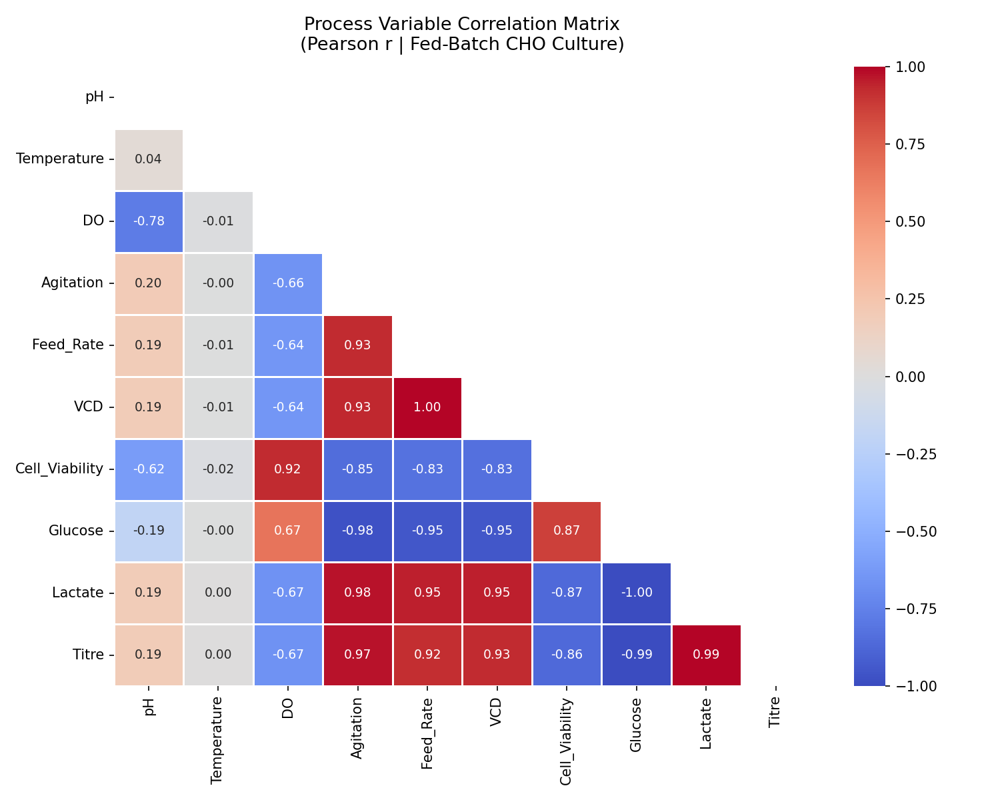
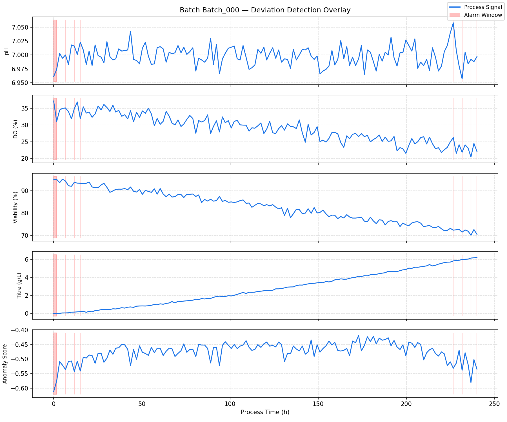
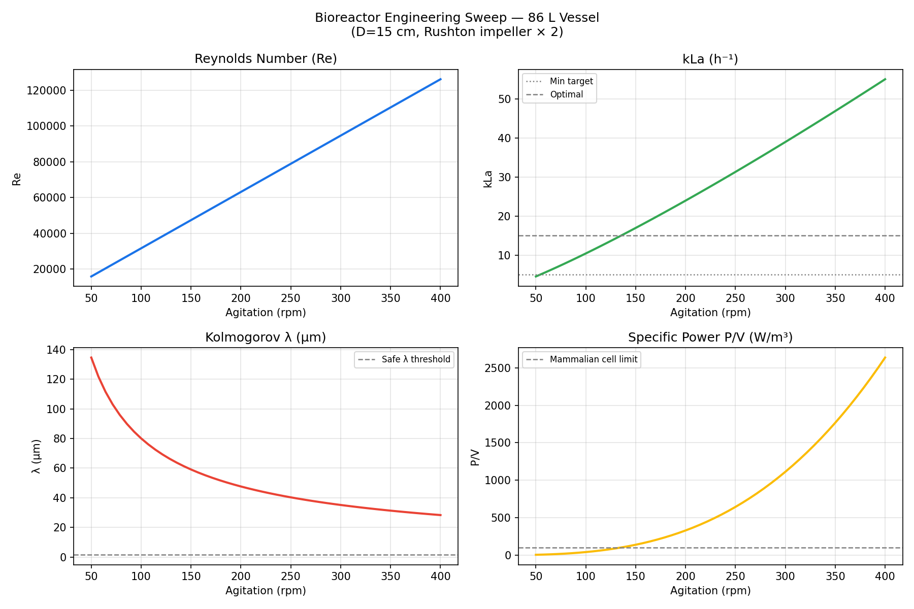
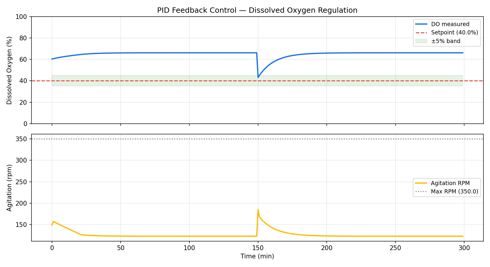

# 🧬 Bio-Process Digital Twin & Quality Control Engine

This project is a prototype for **MSAT (Manufacturing Science and Technology) optimization**, bridging theoretical fluid dynamics with practical bioprocess scaling logic.

## 📊 Sample Outputs

### Module 1 — Multivariate Analysis

### Module 2 — Deviation Detection

### Module 3 — Fluid Dynamics

---
*Developed for academic portfolio and MSAT career path.*
