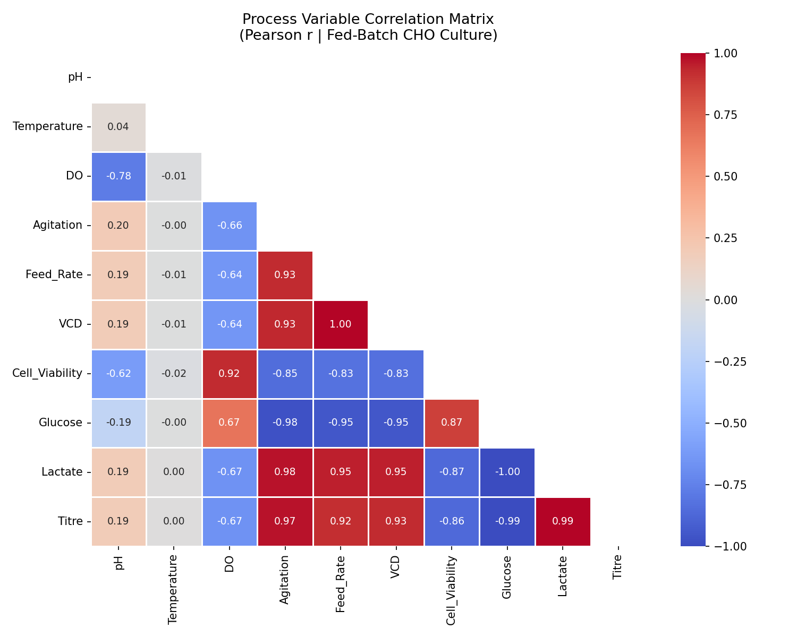
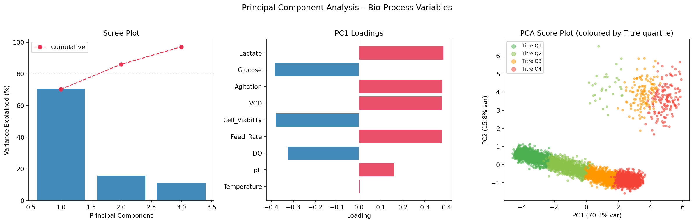
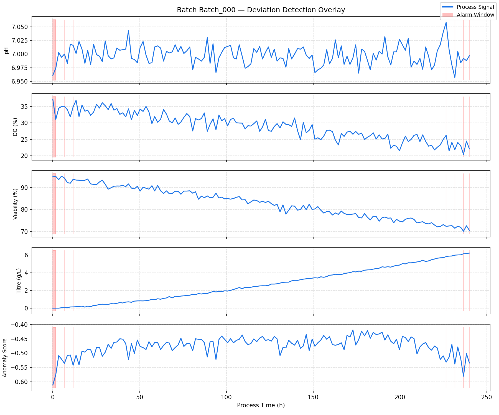
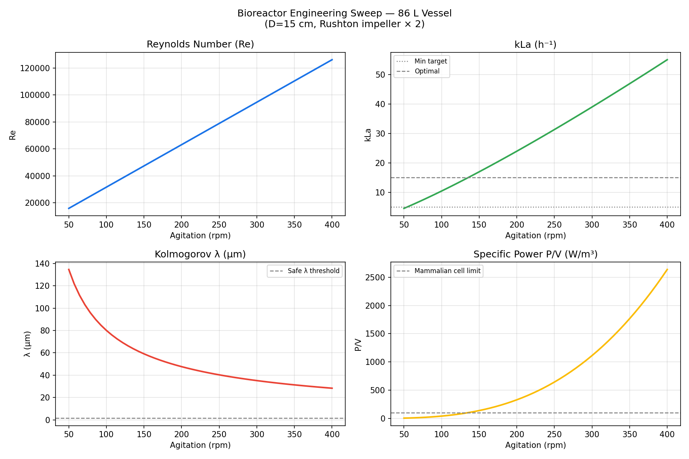
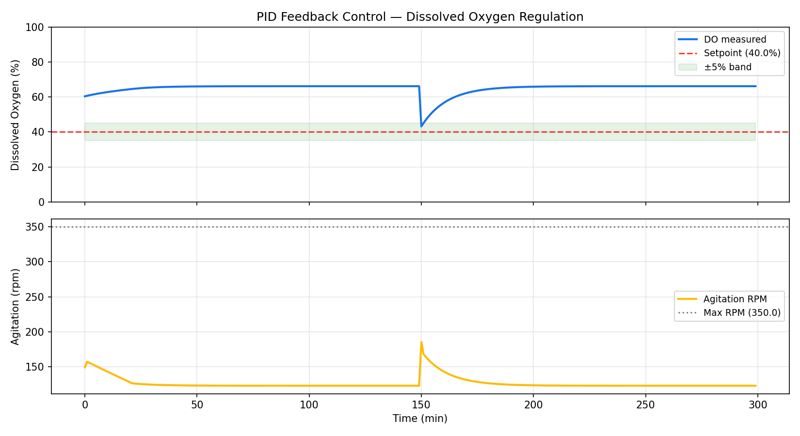

# 🧬 Bioprocess Statistical Monitoring & Deviation Detection Framework


This project is a prototype for **MSAT (Manufacturing Science and Technology) optimization**, bridging theoretical fluid dynamics with practical bioprocess scaling logic.

## 📊 Sample Outputs

### Module 1 — Multivariate Analysis
<p align="center">
  
  
</p>

*Figure 1: Correlation Matrix for CPP identification and PCA for batch clustering.*

### Module 2 — AI-Based Deviation Detection
<p align="center">
  
</p>
*Figure 2: Real-time anomaly mapping using Isolation Forest. The decision boundaries highlight deviations from the "Golden Batch" trajectory.*

### Module 3 — Bioreactor Fluid Dynamics & PID Control
<p align="center">
  
  
</p>
*Figure 3: Hydrodynamic characterisation (Agitation Sweep) and closed-loop PID response for Dissolved Oxygen (DO) stabilisation.*

---

## 🎯 Motivation

In biopharmaceutical manufacturing, **80 % of Lab Investigation Reports (LIRs) and deviations** originate from unexpected interactions between upstream process parameters — pH drift, dissolved oxygen (DO) crashes, or agitation-induced shear stress — rather than from a single identifiable root cause.

This project demonstrates that **computational bioengineering tools can**:

1. Reduce root-cause investigation time through multivariate PCA.
2. Detect process deviations **up to 1–2 hours before** they escalate, using unsupervised machine learning.
3. Quantitatively flag cell damage risk from hydrodynamic shear — a critical gap in manual scale-up workflows.

> **Deployment target:** A real-time digital twin layer on top of a bioreactor MES (Manufacturing Execution System), aligned with FDA PAT guidance (2004) and ICH Q8/Q10 quality-by-design frameworks.

---

## 🏗️ Project Architecture

```text
BioProcess-Optimizer/
├── main.py                        # Orchestration entry point
├── requirements.txt
├── data/
│   └── synthetic_batch_data.py    # Synthetic fed-batch CHO dataset generator
└── bioprocess/
    ├── __init__.py
    ├── multivariate_analysis.py   # Module 1 — PCA + Correlation + ANOVA
    ├── deviation_detector.py      # Module 2 — Isolation Forest + LIR auto-draft
    └── fluid_calculator.py        # Module 3 — Reynolds / kLa / Shear + PID
```

All modules are **OOP-structured** for extensibility (e.g., swapping Isolation Forest for an LSTM-based model requires only a subclass override of `DeviationDetector`).

---

## 📦 Modules

### Module 1 — Multivariate Statistical Analysis

**File:** `bioprocess/multivariate_analysis.py`  
**Class:** `MultivariateAnalyser`

Performs the exploratory data analysis (EDA) phase that MSAT engineers conduct during a manufacturing deviation investigation.

| Method | Description |
|---|---|
| `correlation_heatmap()` | Pearson correlation matrix across all CPPs and CQAs |
| `run_pca(n_components)` | Standardised PCA with scree plot, loading bar chart, and score scatter coloured by Titre quartile |
| `run_anova()` | One-way ANOVA testing Titre difference across pH operating bands (Low / Nominal / High) |
| `full_report()` | Runs all three analyses sequentially |

**Statistical interpretation** is embedded directly in the output — each result maps to a concrete MSAT recommendation (e.g., _"Assign CPP status to Lactate and Glucose; tighten NOR in the next DoE campaign"_).

**Key process variables:** pH · Temperature · DO · Agitation · Feed Rate · VCD · Cell Viability · Titre · Glucose · Lactate

---

### Module 2 — AI-Based Deviation Early Detection

**File:** `bioprocess/deviation_detector.py`  
**Class:** `DeviationDetector`

Implements an **unsupervised Isolation Forest** trained on normal batch observations. The model learns a multivariate normal operating space and flags time points that deviate from it — without requiring labelled deviation data during training.

| Method | Description |
|---|---|
| `fit(df_normal)` | Train on normal process observations |
| `predict(df)` | Score all observations; add `Anomaly_Score` and `Predicted_Dev` columns |
| `plot_anomaly_map(batch_id)` | Time-series overlay with alarm windows highlighted in red |
| `generate_lir(batch_id)` | **Auto-generate a GMP-compliant LIR draft** (see below) |
| `evaluate(df_labelled)` | Precision / Recall / F1 against ground-truth deviation labels |

#### LIR Auto-Draft Feature

When a deviation is detected, the engine automatically generates a structured **Lab Investigation Report** following standard biopharmaceutical GMP template:

```
╔══════════════════════════════════════════════════════════════╗
║          LAB INVESTIGATION REPORT (LIR) — AUTO DRAFT        ║
╚══════════════════════════════════════════════════════════════╝
1. DEVIATION SUMMARY        — batch ID, alarm count, time window
2. PROCESS PARAMETER EXCURSION — pH, DO, Viability statistics  
3. PROBABLE ROOT CAUSE      — primary deviated variable + hypothesis
4. IMMEDIATE CONTAINMENT    — checklisted action items
5. CAPA RECOMMENDATION      — corrective and preventive actions
6. IMPACT ASSESSMENT        — batch disposition status
```

This demonstrates that the tool does not merely **detect** problems — it **accelerates the GMP response workflow**.

---

### Module 3 — Bioreactor Fluid Dynamics Calculator

**File:** `bioprocess/fluid_calculator.py`  
**Classes:** `FluidCalculator`, `BioreactorGeometry`, `FluidState`, `DOController`

Physics-based engineering calculator for stirred-tank bioreactor (STR) design and scale-up studies.

#### Engineering Calculations

| Parameter | Formula / Model | Interpretation Threshold |
|---|---|---|
| **Reynolds Number** | Re = ρND²/µ | Re > 10,000 → fully turbulent |
| **Kolmogorov Eddy Length** | λ = (ν³/ε)^0.25 | λ/d_cell ≥ 0.10 → cell safe |
| **kLa** (van't Riet, 1979) | kLa = C·(P/V)^α·vs^β | Target: 5–15 h⁻¹ for CHO |
| **Specific Power P/V** | P = Np·ρ·N³·D⁵ | < 100 W/m³ for mammalian cells |

#### PID Dissolved Oxygen Controller

`DOController` simulates a **discrete-time PID feedback loop** that manipulates agitation RPM to maintain a DO setpoint — the same control architecture used in Biostat B-DCU and Sartorius ambr° platforms.

```python
pid = DOController(PIDParameters(Kp=2.0, Ki=0.05, Kd=0.5, setpoint=40.0))
rpms, dos = pid.simulate(initial_do=60.0, n_steps=300, disturbance_at=150)
pid.plot_response(rpms, dos)
```

---

## 🚀 Quick Start

```bash
# 1. Clone the repository
git clone https://github.com/jemin6780-afk/Bio-Process-Digital-Twin-Quality-Control-Engine.git
cd Bio-Process-Digital-Twin-Quality-Control-Engine

# 2. Install dependencies
pip install -r requirements.txt

# 3. Run the full pipeline
python main.py
```

Output figures are saved to `outputs/{multivariate,deviation,fluid}/`.

---

## 📊 Sample Outputs

| Module | Output |
|---|---|
| Module 1 | Correlation heatmap · PCA scree plot · Score scatter · ANOVA box-plot |
| Module 2 | Time-series anomaly overlay · LIR `.txt` draft · Precision/Recall report |
| Module 3 | Agitation sweep (Re / kLa / λ / P/V) · PID DO control response |

---

## 🔬 Synthetic Dataset

"To ensure reproducibility while respecting the confidentiality of industrial data, this project utilizes high-fidelity synthetic data simulated based on biokinetic and fluid dynamic principles."

The dataset (`data/synthetic_batch_data.py`) generates **30 × 144 time-point fed-batch CHO cell culture** records with:

- Realistic variable ranges: pH 6.8–7.2, DO 5–70%, Titre 0–8 g/L, VCD 0–130 × 10⁶ cells/mL
- Logistic VCD growth model parameterised with batch-to-batch µ_max variability
- Injected deviation scenarios (pH drift, DO crash) in ~15% of batches
- Ground-truth `Is_Deviation` label for model evaluation

---

## 📐 Design Principles

- **OOP architecture** — each module is a self-contained class with a clean public API, enabling independent unit testing and future integration into a Flask/FastAPI dashboard.
- **GMP-aware outputs** — all interpretations use regulatory vocabulary (CPP, CQA, NOR, CAPA, PAR) aligned with ICH Q8/Q10.
- **Fail-safe interpretation** — every numerical result is accompanied by a conditional interpretation block that maps the value to a process engineering decision, eliminating the risk of silent failures.
- **Scale-up ready** — `BioreactorGeometry` and `FluidState` are dataclasses; scaling from a 50 L pilot to a 2000 L manufacturing vessel requires only changing two parameters.

---

## 🛠️ Technology Stack

| Layer | Library |
|---|---|
| Data wrangling | `pandas`, `numpy` |
| Machine learning | `scikit-learn` (IsolationForest, PCA) |
| Statistics | `scipy.stats` (f_oneway) |
| Visualisation | `matplotlib`, `seaborn` |

---

## 🔭 Roadmap

- [ ] LSTM-based time-series anomaly detection (rolling window)
- [ ] Streamlit web dashboard for real-time batch monitoring
- [ ] Integration with public FDA Adverse Event dataset for CPP benchmarking
- [ ] DoE (Design of Experiments) module for Response Surface Methodology

---

## 👤 About

Built by **Jemin Lee** as part of a self-directed preparation for the MSc Biomaterials and Tissue Engineering programme at **University College London**.

The project is motivated by a core belief: _the missing piece in biopharmaceutical MSAT is not more data — it is the computational infrastructure to make that data actionable in real time._

> *"The goal is not to replace the MSAT engineer. It is to give them a system that flags the problem before it becomes an LIR."*

---

## 📄 License

MIT License — see [LICENSE](LICENSE) for details.
